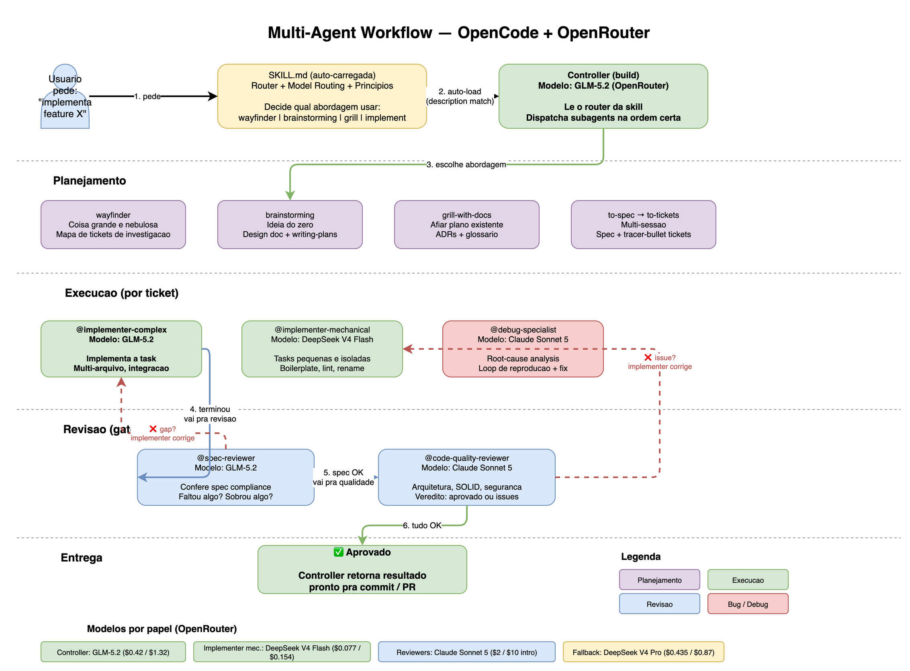

# opencode-multi-agent-workflow

Skill multi-agente para [OpenCode](https://opencode.ai) que roteia trabalho pra subagents especializados, cada um no modelo mais barato que dá conta do recado. Pipeline completo: planejamento, implementação, revisão e entrega.

## Diagrama do fluxo



> Arquivo editável: [docs/workflow.drawio](docs/workflow.png) (abra em [app.diagrams.net](https://app.diagrams.net))

## O que você ganha

- **Workflow router (auto-carregado)** — escolhe a skill certa pra cada situação (wayfinder, brainstorming, grill-with-docs, implement, diagnosing-bugs, triage, prototype). Carrega sozinho quando você pede pra desenvolver feature ou corrigir bug.
- **Model routing por agente** — controller no GLM-5.2, implementers no GLM-5.2 / DeepSeek V4 Flash, reviewers no Claude Sonnet 5, com justificativa de custo-benefício.
- **5 subagents especializados** — implementer-complex, implementer-mechanical, spec-reviewer, code-quality-reviewer, debug-specialist.
- **Loop de revisão estruturado** — implementer → spec reviewer → code-quality reviewer, com re-review quando encontra problema.

## Como funciona automaticamente

Depois de rodar `setup.sh` e reiniciar o OpenCode, três camadas trabalham juntos sem intervenção manual:

| Camada | O que faz | Como carrega |
|---|---|---|
| **Skill** (`SKILL.md`) | Diz pro controller o workflow: qual skill usar quando, tabela de model routing, ordem dos subagents, padrões de código, verify-don't-assume | OpenCode escaneia `~/.config/opencode/skills/` no startup e auto-carrega quando a description matcha com seu pedido (model-invoked) |
| **Subagents** (`agents/*.md`) | 5 agentes especializados com seus próprios modelos e permissões, em `~/.config/opencode/agents/` | OpenCode carrega tudo no startup; invoca via `@agent-name` ou o controller dispatcha automaticamente seguindo a skill |
| **Config** (`opencode.json`) | Seta o `build` (controller) pra GLM-5.2, habilita permissão `task` pra poder dispatchar subagents, seta `small_model` pra DeepSeek V4 Flash | Carregado uma vez no startup |

**Fluxo:** você pede pro OpenCode implementar feature → a skill auto-carrega → o controller (GLM-5.2) lê o router → escolhe a abordagem (brainstorming, implement, etc.) → dispatcha os subagents na ordem certa (implementer → spec-reviewer → code-quality-reviewer) → cada subagent roda no seu modelo → resultado volta pra você.

**Não precisa invocar `@agent-name` manualmente** — o controller faz sozinho seguindo as instruções da skill. Mas você pode invocar manualmente se quiser.

## Pré-requisitos

1. **[OpenCode](https://opencode.ai)** instalado
2. **OpenRouter** conectado — roda `/connect` no OpenCode e adiciona sua API key
3. **Coleção de skills superpowers** — o router referencia skills do [superpowers](https://github.com/obra/superpowers) (wayfinder, brainstorming, grill-with-docs, implement, tdd, code-review, etc.). Instala antes, ou adapta o router no `SKILL.md` pras suas skills. O setup script checa isso e avisa se faltar.

## Instalação

```bash
git clone https://github.com/matheusmski1/opencode-multi-agent-workflow.git
cd opencode-multi-agent-workflow
chmod +x scripts/setup.sh
./scripts/setup.sh
```

Depois **reinicia o OpenCode** pra carregar tudo.

O setup script:
1. Checa pré-requisitos (python3, OpenCode, skills de superpowers)
2. Copia `SKILL.md` pra `~/.config/opencode/skills/multi-agent-workflow/SKILL.md`
3. Copia 5 templates de subagents pra `~/.config/opencode/agents/`
4. Injeta model routing e config do agente `build` no `~/.config/opencode/opencode.json`

## Uso

Depois do setup, basta usar o OpenCode normalmente. A skill auto-carrega quando você pede pra desenvolver feature, corrigir bug ou rodar workflow estruturado. O controller roteia o trabalho pros subagents certos automaticamente.

Você também pode invocar subagents manualmente:

```
@implementer-complex implementa a feature de autenticação de usuário
@spec-reviewer revisa as mudanças contra a spec
@code-quality-reviewer revisa o código em arquitetura e segurança
```

### Workflow completo por ticket

```
1. @implementer-complex   → implementa a task
2. @spec-reviewer         → confere spec compliance
3. @code-quality-reviewer → revisa qualidade do código
```

Só avança quando cada agente aprova. Se o reviewer encontrar problema, o implementer corrige e o reviewer re-revisa.

## Customização

### Modelos

Edita `SKILL.md` e os templates em `agents/` pra trocar os modelos. A análise de custo-benefício que motivou os defaults tá em `research/llm-coding-agents-cost-benefit.md`. Reconfirma os preços no OpenRouter antes de fixar roteamento de longo prazo.

### Skills

O router em `SKILL.md` referencia skills da coleção superpowers. Se você usa outro conjunto de skills, edita a tabela do router pra bater com suas skills.

### Prompts dos agentes

Cada agente em `agents/` é um arquivo markdown com frontmatter (`model`, `mode`, `permission`, `temperature`) e um system prompt. Edita pra bater com seus padrões de código e workflow.

## Modelos por papel

| Papel | Modelo primário | Fallback | Custo (input/output por 1M tokens) |
|---|---|---|---|
| Controller / planner | GLM-5.2 | DeepSeek V4 Pro | $0.42 / $1.32 |
| Implementer complexo | GLM-5.2 | DeepSeek V4 Pro | $0.42 / $1.32 |
| Implementer mecânico | DeepSeek V4 Flash | Poolside Laguna XS 2.1 | $0.077 / $0.154 |
| Spec reviewer | GLM-5.2 | Claude Sonnet 5 | $0.42 / $1.32 |
| Code-quality reviewer | Claude Sonnet 5 | GLM-5.2 | $2 / $10 (intro) |
| Debug specialist | Claude Sonnet 5 | GLM-5.2 | $2 / $10 (intro) |

## Estrutura

```
opencode-multi-agent-workflow/
├── SKILL.md                                # router + model routing + subagents + princípios
├── agents/                                  # templates dos subagents
│   ├── implementer-complex.md              # GLM-5.2
│   ├── implementer-mechanical.md           # DeepSeek V4 Flash
│   ├── spec-reviewer.md                    # GLM-5.2
│   ├── code-quality-reviewer.md            # Claude Sonnet 5
│   └── debug-specialist.md                 # Claude Sonnet 5
├── docs/
│   ├── workflow.drawio                     # diagrama editável
│   └── workflow.png                        # diagrama renderizado
├── scripts/
│   └── setup.sh                            # instalador (skill + agents + config)
├── research/
│   └── llm-coding-agents-cost-benefit.md   # análise custo-benefício dos modelos
└── README.md
```

## Licença

MIT